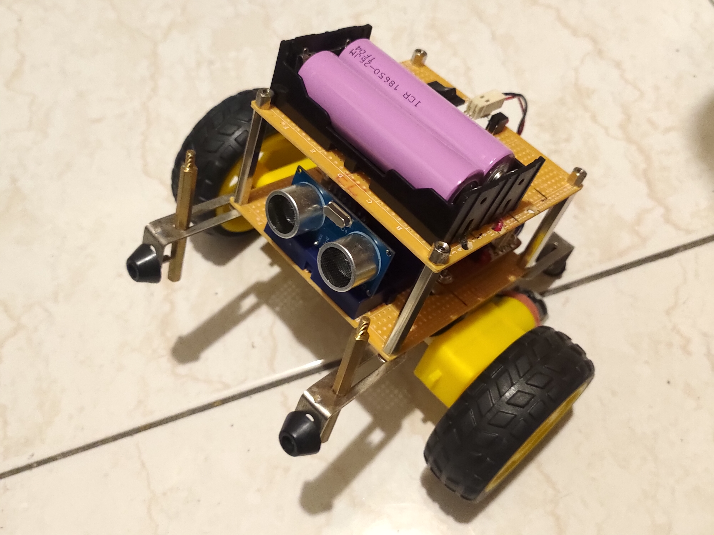

# ESP32-Self-Balancing-Robot-with-MPU6050-and-PID-Control
ESP32-based Two-Wheeled Self-Balancing Robot Using MPU6050 and PID Control

prototype demo
## Wiring
- ESP32 GPIO22 -> MPU6050 SCL
- ESP32 GPIO21 -> MPU6050 SDA
- ESP32 GPIO4  -> MPU6050 INT
- ESP32 GPIO13 ->
- ESP32 GPIO39 ->
- ESP32 GPIO33 -> L298N In1
- ESP32 GPIO25 -> L298N In2
- ESP32 GPIO26 -> L298N In3
- ESP32 GPIO27 -> L298N In4
- ESP32 GPIO14 -> L298N EnableA (PWM)
- ESP32 GPIO12 -> L298N EnableB (PWM)
- L298N Out1 -> Right Motor +
- L298N Out2 -> Right Motor -
- L298N Out3 -> Left Motor +
- L298N Out4 -> Left Motor -
- Battery+ -> L298N 12V
- L298N 5V -> ESP32 Ext5V
- ESP32 +5V -> MPU6050 VCC
